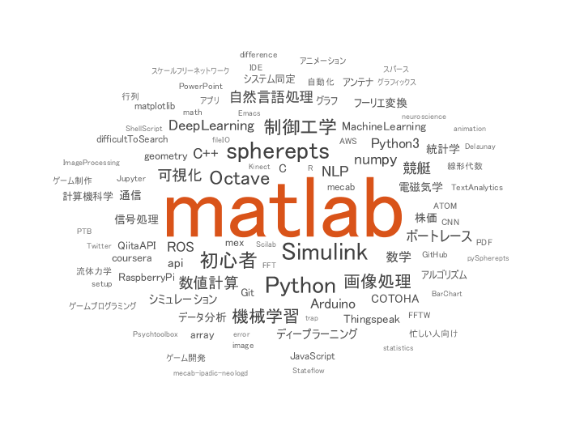
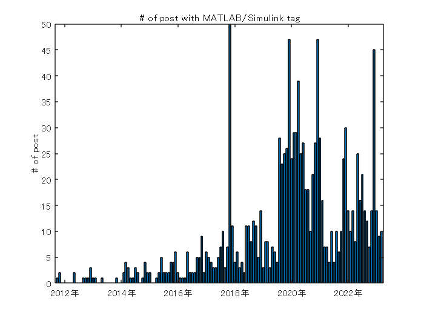
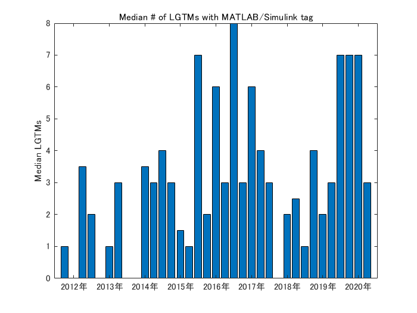

# Qiita API でデータ抽出
[](https://jp.mathworks.com/matlabcentral/fileexchange/75099-qiita-api-qiita)

Qiita は Qiita API を公開しており、様々なデータ抽出を可能にしてくれています。ここでは MATLAB / Simulink タグの投稿状況を見てみます。


# 記事データ取得


matlab タグ、simulink タグがついた全記事を取得します。ご自身の accessToken を取得してお試しください。


```matlab:Code
clear
loadFlag = false;

if loadFlag || ~exist('allArticles.mat','file')
    % アクセストークン使用（ご自身の accessToken を取得してお試しください）
    accessToken = 'Bearer xxxxxxxxxxxxxxxxxxxxxxxxxxxxxxxxxxxxxxxx';
    opts = weboptions('HeaderFields',{'Authorization',accessToken});
    % opts = weboptions; % アクセストークン使用しない場合
    
    page = 1;
    data = [];
    tags = ["matlab","simulink"];
    for ii=1:2 % 2つの tag をループで処理
        page = 1;
        while true
            % 1 request 辺りの上限が 100 件なので繰り返し処理
            url = "https://qiita.com/api/v2/tags/" + tags(ii) + "/items?page="+page+"&per_page=100";
            tmp = webread(url,opts);
            if isempty(tmp)
                break;
            end
            data = [data;tmp]; %#ok<AGROW> 
            page = page + 1;
        end
    end
    % テーブル型に変更
    data = struct2table(data);
    
    % 念のため unique で重複回避
    [~,ia,~] = unique(data.id);
    data = data(ia,:);
    save('allArticles.mat','data')
else
    load allArticles.mat %#ok<UNRCH> 
end
```

# データ確認


冒頭の8アイテムを表示してみます。変数として `title`、`rendered_body` や `created_at`、`like_count` など全16変数が取れていることが分かります。 (rendered_body と body はアレなので削除して表示します。)


```matlab:Code
head(removevars(data,{'rendered_body','body'}))
```

| |coediting|comments_count|created_at|group|id|likes_count|private|reactions_count|tags|title|updated_at|url|user|page_views_count|
|:--:|:--:|:--:|:--:|:--:|:--:|:--:|:--:|:--:|:--:|:--:|:--:|:--:|:--:|:--:|
|1|0|0|'2018-05-05T23:01:26+09:00'|[]|'009a739099fbd50e09ef'|1|0|0|2x1 struct|'時系列データ分析の書籍のサンプルデータをMATLABで試してみた'|'2018-05-05T23:01:26+09:00'|'https://qiita.com/Alberobellojiro/items/009a739099fbd50e09ef'|1x1 struct|[]|
|2|0|6|'2019-09-02T01:13:35+09:00'|[]|'00c11b080c6905dd4444'|32|0|0|3x1 struct|'MATLABx深層学習x顕微赤外分光法'|'2019-09-02T01:15:47+09:00'|'https://qiita.com/nHounoki/items/00c11b080c6905dd4444'|1x1 struct|[]|
|3|0|0|'2018-08-09T14:05:25+09:00'|[]|'00f695f6c476d93897bc'|4|0|0|5x1 struct|'スマホで撮った写真をディープラーニングで判定してみる　(学習編)'|'2018-08-17T14:27:20+09:00'|'https://qiita.com/p_panther/items/00f695f6c476d93897bc'|1x1 struct|[]|
|4|0|0|'2015-09-12T01:20:41+09:00'|[]|'0190eeee811ceecdd457'|0|0|0|1x1 struct|'Matlab Wars 1.0'|'2015-09-12T01:31:04+09:00'|'https://qiita.com/Shadowys/items/0190eeee811ceecdd457'|1x1 struct|[]|
|5|0|0|'2017-11-26T11:01:38+09:00'|[]|'01e9dc011193e24caa0d'|1|0|0|4x1 struct|'MATLABとMatplotlib 3dの座標系 | viewの違い > view(azimuth=0) > MATLAB:xaxisが横軸 | Matplotlib:yaxisが横軸 > MatplotlibとMATLABで同じ表示にするには'|'2017-11-27T08:11:17+09:00'|'https://qiita.com/7of9/items/01e9dc011193e24caa0d'|1x1 struct|[]|
|6|0|0|'2020-02-08T19:10:45+09:00'|[]|'01f7ed446a4ccfca5972'|2|0|0|5x1 struct|'畳み込みニューラルネットワーク（CNN)の説明が、頑張りすぎでは？（MathWorksのdeepDreamImageとかも）'|'2020-03-14T04:32:15+09:00'|'https://qiita.com/enoughspacefor/items/01f7ed446a4ccfca5972'|1x1 struct|[]|
|7|0|0|'2020-04-06T10:09:47+09:00'|[]|'02b5b0b2bafe51d97602'|5|0|0|4x1 struct|'1.6 Simulinkによる画像処理'|'2020-04-06T10:42:21+09:00'|'https://qiita.com/tohruk/items/02b5b0b2bafe51d97602'|1x1 struct|[]|
|8|0|0|'2019-08-23T13:50:07+09:00'|[]|'02cce7d5d2b89ab08b37'|7|0|0|5x1 struct|'MATLAB の Live Editor でインタラクティブな処理してみた。'|'2019-08-23T14:06:23+09:00'|'https://qiita.com/kkado/items/02cce7d5d2b89ab08b37'|1x1 struct|[]|

# 時系列データ集計


投稿数の推移を集計するために `timetable` 型を活用します。


作成日時 `created_at` は `datetime` 型にします。フォーマットに注目。


```matlab:Code
created_at = datetime(vertcat(data.created_at),...
    'InputFormat', "uuuu-MM-dd'T'HH:mm:ss'+09:00");
tData = table2timetable(data(:,{'title','user','likes_count','tags','url'}),'RowTimes', created_at);
```


ここではタイトル、ユーザー名、いいね数、タグ、Page URL だけを残しておきます。`url` はセルの中に `char` で入っている状態なので簡単ですが、`user` はセルに入った構造体 `tag` はセルに入った構造体ベクトルなので少しややこしい。


具体的にはこんな感じ・・


```matlab:Code
tData.user(1)
```


```text:Output
ans = 
            description: '大学時代はC言語でポインターを駆使して画像処理、時系列データ解析を行い、SIerでシステム設計、ソフトウェア開発(主にJavaScriptのフロントエンド)を行い、現在は外資系IT企業でエンジニアをやっています。HTML/JavaScript、PHP、Java、.NET、MATLAB、SQLなどなど、色々なプログラム言語を使うので、言語の違いを楽しみながら日々バリバリ書いています。'
            facebook_id: ''
        followees_count: 3
        followers_count: 7
      github_login_name: []
                     id: 'Alberobellojiro'
            items_count: 3
            linkedin_id: ''
               location: ''
                   name: ''
           organization: ''
           permanent_id: 254990
      profile_image_url: 'https://qiita-image-store.s3.amazonaws.com/0/254990/profile-images/1525506429'
              team_only: 0
    twitter_screen_name: []
            website_url: ''

```


```matlab:Code
tData.tags{1}
```

|フィールド|name|versions|
|:--:|:--:|:--:|
|1|'R'|[ ]|
|2|'matlab'|[ ]|


ここでは `timetable` 型の各行に関数を適用する `rowfun` 関数を使ってみます。`tags` については構造体の `name` メンバーだけを `string` 型のベクトルに変換。諦めて for ループで回した方が可読性がよいかもしれませんね。


```matlab:Code
tData.url = string(tData.url);
tData.user = rowfun(@(x) string(x.id),tData,'InputVariable','user','ExtractCellContents',true,'OutputFormat','uniform');
tData.tags = rowfun(@(x) string({x.name}),tData,'InputVariable','tags','ExtractCellContents',true,'SeparateInputs',true,'OutputFormat','cell');
```


結果こんな感じです。ついでに時系列順に並べておきましょう。


```matlab:Code
tData = sortrows(tData,'Time','descend');
head(tData)
```

| |Time|title|user|likes_count|tags|url|
|:--:|:--:|:--:|:--:|:--:|:--:|:--:|
|1|17/Apr/2020 10:38:37|'Matlabで時系列データを周波数解析する'|"hogemaccho"|1|1x2 string|"https://qiita.com/hogemaccho/items/91d290fccdaec0e5e5ea"|
|2|17/Apr/2020 09:22:29|'2.1.2 画像・3次元ボリュームデータ・医用画像(DICOM/NIfTI)の表示'|"tohruk"|3|1x5 string|"https://qiita.com/tohruk/items/43b3dd1451b99b99cde3"|
|3|16/Apr/2020 08:38:00|'5.6.6 ディープラーニング：点群データのサポート'|"tohruk"|2|1x5 string|"https://qiita.com/tohruk/items/18efdb0bd502fbd805e6"|
|4|16/Apr/2020 07:04:51|'【MATLAB】エラトステネスの篩を実装して素数リストを作ってみた'|"takumi_ueda"|2|1x3 string|"https://qiita.com/takumi_ueda/items/0407eb902c73cc912912"|
|5|15/Apr/2020 11:55:20|'[MATLAB]初心者が初見で必ずthinking顔になるもの特集'|"motorcontrolman"|47|1x2 string|"https://qiita.com/motorcontrolman/items/b8d89a0cc09c73e058cb"|
|6|15/Apr/2020 07:59:57|'【MATLAB】行列を与えると随伴行列を返す関数を作って、公式と同じ結果が得られるか試してみた'|"takumi_ueda"|2|1x3 string|"https://qiita.com/takumi_ueda/items/515e73fb69952e276ae0"|
|7|15/Apr/2020 02:52:55|'n次元ベクトルの回転行列(ゆっくり解説動画もついてるんだぜ！)'|"LGTM912"|2|1x5 string|"https://qiita.com/LGTM912/items/e7176ddb6c06bb09a64d"|
|8|14/Apr/2020 09:50:39|'MATLABでMeCabの品詞細分類を活用する：その2'|"h583"|2|1x3 string|"https://qiita.com/h583/items/e223d9c75b653fda7d34"|

# ワードクラウド


どんなタグがあるのかワードクラウド表示してみます。


```matlab:Code
alltags = [tData.tags{:}];
[N,Categories] = histcounts(categorical(alltags));
wordcloud(Categories,N)
```




# 月間投稿数推移


月間投稿数を集計してみます。ここは `retime` の出番です。


```matlab:Code(Display)
TT2 = retime(TT1,newTimeStep,method)
```


と、新しい時間ステップ `newTimeStep` と集計方法 `method` を指定します。月間投稿数であれば


```matlab:Code
tmp = retime(tData(:,'title'),'monthly','count');
```


棒グラフ表示しますと、2019 年後半から急増していることは分かりますね。2019年12月のピークはアドベントカレンダーの影響です。


```matlab:Code
bar(tmp.Time,tmp.title)
title('# of post with MATLAB/Simulink tag')
ylabel('# of post')
```




# OnThisDay


過去の「この日」に投稿された記事・・という順に並べてみます。たとえば過去の投稿をなつかしんだり。。


まず `ymd` 関数で日付を年、月、日に分解します。


```matlab:Code
% get the month/day of when the post is created
[y,m,d] = ymd(tData.Time);
```


そして年数を引く・・と


```matlab:Code
daysofYear = tData.Time - years(y);
[tData.Time(1), daysofYear(1)]
```


```text:Output
ans = 1x2 datetime    
17/Apr/2020 10:38:37    17/Apr/0000 02:14:37    

```


うまくいきません。年によって実際の長さが違うから・・だと思います。年数だけ引く場合は `calyears` を使います。


```matlab:Code
daysofYear = tData.Time - calyears(y);
[tData.Time(1), daysofYear(1)]
```


```text:Output
ans = 1x2 datetime    
17/Apr/2020 10:38:37    17/Apr/0000 10:38:37    

```


キッチリ年数分引けていますね。ということで、記事の年齢（何年前に投稿された記事か）をデータに加えて、1月から順に並べておきます。


```matlab:Code
% How old the posts are
tData.howOld = 2020 - y;
% sort by the days of the year
[~,idx] = sort(daysofYear,'ascend');
tData = tData(idx,:);
head(tData)
```

| |Time|title|user|likes_count|tags|url|howOld|
|:--:|:--:|:--:|:--:|:--:|:--:|:--:|:--:|
|1|01/Jan/2017 04:17:02|'MATLAB2015b(32bit版)でpointgrayのサポートパッケージが動かない話'|"nomper"|0|1x4 string|"https://qiita.com/nomper/items/45e47434f746d852acd4"|3|
|2|02/Jan/2020 06:49:23|'マハラノビス距離の説明とmatlabでの実験'|"pengin6"|16|"matlab"|"https://qiita.com/pengin6/items/467287eef6d711e1313a"|0|
|3|03/Jan/2020 11:43:04|'Simulink API (4) Simulink APIを使う"目的"と前回の続き'|"stozaki"|4|1x3 string|"https://qiita.com/stozaki/items/bad07d0e6e1c571dfc47"|0|
|4|04/Jan/2020 07:00:03|'Simulinkで機械学習モデルを使いたい'|"stkt_KU"|5|1x3 string|"https://qiita.com/stkt_KU/items/51c144401ad8a284e1b1"|0|
|5|05/Jan/2020 11:29:30|'レーダの中身について(初級)'|"tommyecguitar"|23|1x4 string|"https://qiita.com/tommyecguitar/items/d65082968466c18e5bab"|0|
|6|06/Jan/2020 05:47:24|'このプロットどうやって描いたの？：複数プロット、アニメーション編'|"eigs"|46|1x3 string|"https://qiita.com/eigs/items/c6efb11c145e4e0e8577"|0|
|7|06/Jan/2020 09:50:44|'レーダの中身について\~距離、速度測定\~'|"tommyecguitar"|11|1x4 string|"https://qiita.com/tommyecguitar/items/09dcebde31122990a899"|0|
|8|08/Jan/2020 02:08:08|'MATLABからPythonライブラリを利用したかった話'|"larking95"|4|1x4 string|"https://qiita.com/larking95/items/70d24ac9a78d56d53dff"|0|

# 投稿された曜日


曜日については


```matlab:Code(Display)
d = day(t,'name')
```


の構文でとれます。


```matlab:Code
tData.dayofWeek = day(tData.Time,'name');
```


曜日別に投稿数を確認してみます。


```matlab:Code
histogram(categorical(tData.dayofWeek));
```





あんまり差がないですね。一応月曜日が一番多いですね。


表示がアルファベット順なので修正。


```matlab:Code
histogram(categorical(tData.dayofWeek),["Sunday","Monday","Tuesday","Wednesday","Thursday","Friday","Saturday"]);
```


