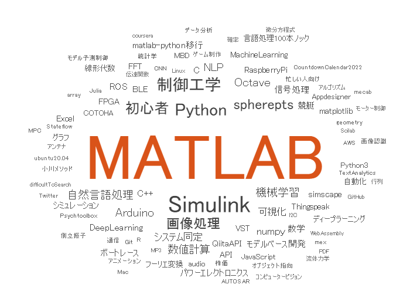
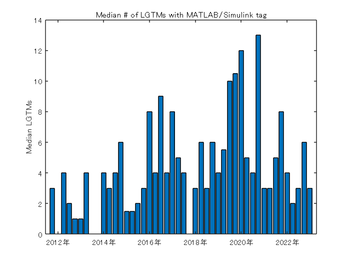
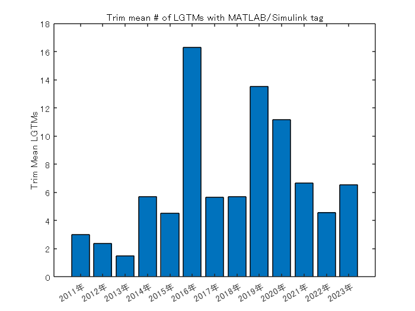

# Qiita API でデータ抽出

Copyright (c) 2020-2023, The MathWorks, Inc.

> [](https://jp.mathworks.com/matlabcentral/fileexchange/75099-qiita-api-qiita)

Qiita は Qiita API を公開しており、様々なデータ抽出を可能にしてくれています。ここでは MATLAB / Simulink タグの投稿状況を見てみます。


# 記事データ取得

matlab タグ、simulink タグがついた全記事を取得します。ご自身の accessToken を取得してお試しください。

```matlab:Code
clear
loadFlag = false;

if loadFlag || ~exist('allArticles.mat','file')
    % アクセストークン使用（ご自身の accessToken を取得してお試しください）
    accessToken = 'Bearer xxxxxxxxxxxxxxxxxxxxxxxxxxxxxxxxxxxxxxxx';
    opts = weboptions('HeaderFields',{'Authorization',accessToken});
    % opts = weboptions; % アクセストークン使用しない場合
    
    page = 1;
    data = [];
    tags = ["matlab","simulink"];
    for ii=1:2 % 2つの tag をループで処理
        page = 1;
        while true
            % 1 request 辺りの上限が 100 件なので繰り返し処理
            url = "https://qiita.com/api/v2/tags/" + tags(ii) + "/items?page="+page+"&per_page=100";
            tmp = webread(url,opts);
            if isempty(tmp)
                break;
            end
            data = [data;tmp]; %#ok<AGROW>
            page = page + 1;
        end
    end
    % テーブル型に変更
    data = struct2table(data);
    
    % 念のため unique で重複回避
    [~,ia,~] = unique(data.id);
    data = data(ia,:);
    save('allArticles.mat','data')
else
    load allArticles.mat %#ok<UNRCH>
end
```

# データ確認

冒頭の8アイテムを表示してみます。変数として `title`、`rendered_body` や `created_at`、`like_count` など全16変数が取れていることが分かります。 (rendered_body と body はアレなので削除して表示します。)

```matlab:Code
head(removevars(data,{'rendered_body','body'}))
```

```text:Output
    coediting    comments_count             created_at                 group                   id               likes_count    private    reactions_count    stocks_count        tags                                  title                                       updated_at                                            url                                      user       page_views_count    team_membership    organization_url_name
    _________    ______________    _____________________________    ____________    ________________________    ___________    _______    _______________    ____________    ____________    _________________________________________________________    _____________________________    ________________________________________________________________    __________    ________________    _______________    _____________________

      false            0           {'2018-05-05T23:01:26+09:00'}    {0x0 double}    {'009a739099fbd50e09ef'}         3          false            0                 1         {2x1 struct}    {'時系列データ分析の書籍のサンプルデータをMATLABで試してみた'    }    {'2018-05-05T23:01:26+09:00'}    {'https://qiita.com/Alberobellojiro/items/009a739099fbd50e09ef'}    1x1 struct      {0x0 double}       {0x0 double}          {0x0 double}     
      false            6           {'2019-09-02T01:13:35+09:00'}    {0x0 double}    {'00c11b080c6905dd4444'}        34          false            0                33         {3x1 struct}    {'MATLABx深層学習x顕微赤外分光法'                           }    {'2019-09-02T01:15:47+09:00'}    {'https://qiita.com/nHounoki/items/00c11b080c6905dd4444'       }    1x1 struct      {0x0 double}       {0x0 double}          {0x0 double}     
      false            0           {'2020-07-08T11:40:09+09:00'}    {0x0 double}    {'00de0cdac6cd381a0378'}         0          false            0                 0         {1x1 struct}    {'「Not a binary MAT-file.」のデバッグ方法【MATLAB】'       }    {'2023-03-04T23:29:35+09:00'}    {'https://qiita.com/umi_mori/items/00de0cdac6cd381a0378'       }    1x1 struct      {0x0 double}       {0x0 double}          {'ai-lab'  }     
      false            2           {'2020-05-04T00:01:18+09:00'}    {0x0 double}    {'00edba75081f1733c228'}         7          false            0                 3         {3x1 struct}    {'AtCoderに登録したら解くべき精選過去問10問をMATLABで解いてみた'}    {'2020-08-31T12:53:29+09:00'}    {'https://qiita.com/Pojoy/items/00edba75081f1733c228'          }    1x1 struct      {0x0 double}       {0x0 double}          {0x0 double}     
      false            0           {'2018-08-09T14:05:25+09:00'}    {0x0 double}    {'00f695f6c476d93897bc'}         5          false            0                 4         {5x1 struct}    {'スマホで撮った写真をディープラーニングで判定してみる　(学習編)'  }    {'2018-08-17T14:27:20+09:00'}    {'https://qiita.com/p_panther/items/00f695f6c476d93897bc'      }    1x1 struct      {0x0 double}       {0x0 double}          {0x0 double}     
      false            7           {'2020-10-03T19:43:08+09:00'}    {0x0 double}    {'010b1ef05c530b1284cb'}        90          false            0                74         {3x1 struct}    {'【FDTD解説シリーズ①】FDTDで電磁界解析基礎'                 }    {'2020-10-25T17:51:09+09:00'}    {'https://qiita.com/tommyecguitar/items/010b1ef05c530b1284cb'  }    1x1 struct      {0x0 double}       {0x0 double}          {0x0 double}     
      false            2           {'2022-08-11T18:10:22+09:00'}    {0x0 double}    {'01226dfd124daaec83b3'}         2          false            0                 0         {4x1 struct}    {'数値・統計解析ソフトウェアをまとめてみた'                    }    {'2022-08-11T18:10:22+09:00'}    {'https://qiita.com/wozisagi/items/01226dfd124daaec83b3'       }    1x1 struct      {0x0 double}       {0x0 double}          {0x0 double}     
      false            0           {'2015-09-12T01:20:41+09:00'}    {0x0 double}    {'0190eeee811ceecdd457'}         0          false            0                 0         {1x1 struct}    {'Matlab Wars 1.0'                                      }    {'2015-09-12T01:31:04+09:00'}    {'https://qiita.com/Shadowys/items/0190eeee811ceecdd457'       }    1x1 struct      {0x0 double}       {0x0 double}          {0x0 double}     
```

# 時系列データ集計

投稿数の推移を集計するために `timetable` 型を活用します。

作成日時 `created_at` は `datetime` 型にします。フォーマットに注目。

```matlab:Code
created_at = datetime(vertcat(data.created_at),...
    'InputFormat', "uuuu-MM-dd'T'HH:mm:ss'+09:00");
tData = table2timetable(data(:,{'title','user','likes_count','tags','url'}),'RowTimes', created_at);
```

ここではタイトル、ユーザー名、いいね数、タグ、Page URL だけを残しておきます。`url` はセルの中に `char` で入っている状態なので簡単ですが、`user` はセルに入った構造体 `tag` はセルに入った構造体ベクトルなので少しややこしい。

具体的にはこんな感じ・・

```matlab:Code
tData.user(1)
```

```text:Output
ans = 
            description: '大学時代はC言語でポインターを駆使して画像処理、時系列データ解析を行い、SIerでシステム設計、ソフトウェア開発(主にJavaScriptのフロントエンド)を行い、現在は外資系IT企業でエンジニアをやっています。HTML/JavaScript、PHP、Java、.NET、MATLAB、SQLなどなど、色々なプログラム言語を使うので、言語の違いを楽しみながら日々バリバリ書いています。'
            facebook_id: ''
        followees_count: 3
        followers_count: 9
      github_login_name: []
                     id: 'Alberobellojiro'
            items_count: 4
            linkedin_id: ''
               location: ''
                   name: ''
           organization: ''
           permanent_id: 254990
      profile_image_url: 'https://qiita-image-store.s3.amazonaws.com/0/254990/profile-images/1525506429'
              team_only: 0
    twitter_screen_name: []
            website_url: ''

```

```matlab:Code
tData.tags{1}
```

|フィールド|name|versions|
|:--:|:--:|:--:|
|1|'R'|[ ]|
|2|'MATLAB'|[ ]|

ここでは `timetable` 型の各行に関数を適用する `rowfun` 関数を使ってみます。`tags` については構造体の `name` メンバーだけを `string` 型のベクトルに変換。諦めて for ループで回した方が可読性がよいかもしれませんね。

```matlab:Code
tData.url = string(tData.url);
tData.user = rowfun(@(x) string(x.id),tData,'InputVariable','user','ExtractCellContents',true,'OutputFormat','uniform');
tData.tags = rowfun(@(x) string({x.name}),tData,'InputVariable','tags','ExtractCellContents',true,'SeparateInputs',true,'OutputFormat','cell');
```

結果こんな感じです。ついでに時系列順に並べておきましょう。

```matlab:Code
tData = sortrows(tData,'Time','descend');
head(tData)
```

```text:Output
           Time                                                title                                            user         likes_count                                       tags                                                                  url                            
    ___________________    _____________________________________________________________________________    _____________    ___________    __________________________________________________________________________    __________________________________________________________

    2023/03/20 15:50:23    {'データに基づくプラントモデリングおよびコントローラー開発'                           }    "getBack1969"         2         {["MATLAB"    "制御工学"    "Simulink"    "モデル予測制御"    "システム同定"  ]}     "https://qiita.com/getBack1969/items/f01a105e2b4ac3b424b6"
    2023/03/20 08:34:26    {'ChatGPTでSimulinkモデルを作ってみた'                                         }    "covao"               4         {["MATLAB"    "Simulink"    "ChatGPT"    "ChatGPTPlus"    "GPT-4"       ]}    "https://qiita.com/covao/items/fa728b6a813c79687a6c"      
    2023/03/19 00:35:03    {'ChatGPT-4でMATLAB Codyの問題を解いてみた'                                    }    "covao"               1         {["MATLAB"    "ChatGPT"    "ChatGPTPlus"    "GPT-4"                     ]}    "https://qiita.com/covao/items/dd4baff4f28a025e65ec"      
    2023/03/17 07:33:24    {'「グラフ背景色をデータの追加とともに変化させるアニメーション作成」を R2023a でシンプルに'}    "eigs"                3         {["MATLAB"    "アニメーション"    "グラフ"    "GIF"    "可視化"             ]}     "https://qiita.com/eigs/items/0daa2a5a7e7edcf69be8"       
    2023/03/17 00:57:27    {'【Simulink】モデル エクスプローラーでブロックや信号線を検索する'                    }    "nrykot"              3         {["検索"    "Simulink"    "モデルエクスプローラー"                          ]}     "https://qiita.com/nrykot/items/e1036cb7257ae903393e"     
    2023/03/15 11:27:18    {'閉ループステップ応答データを用いたデータドリブンな周波数応答推定(MATLAB編)'           }    "AICONTROL"           8         {["MATLAB"    "制御工学"    "データサイエンス"    "周波数解析"    "システム同定"]}     "https://qiita.com/AICONTROL/items/c4f16c597e992348b81c"  
    2023/03/14 11:12:49    {'Path Planningを最適制御問題として解く'                                        }    "Mya-Mya"             3         {["MATLAB"    "PathPlanning"                                            ]}    "https://qiita.com/Mya-Mya/items/5346a40b47a0f33daa94"    
    2023/03/09 19:08:19    {'航空機の飛行制御 ～故障に耐える＝耐故障～'                                       }    "getBack1969"         6         {["MATLAB"    "制御工学"    "Simulink"    "適応制御"    "航空宇宙"          ]}     "https://qiita.com/getBack1969/items/7c468da490055dec98f4"
```

# ワードクラウド

どんなタグがあるのかワードクラウド表示してみます。

```matlab:Code
alltags = [tData.tags{:}];
[N,Categories] = histcounts(categorical(alltags));
wordcloud(Categories,N)
```



# 月間投稿数推移

月間投稿数を集計してみます。ここは `retime` の出番です。

```matlab:Code(Display)
TT2 = retime(TT1,newTimeStep,method)
```

と、新しい時間ステップ `newTimeStep` と集計方法 `method` を指定します。月間投稿数であれば

```matlab:Code
tmp = retime(tData(:,'title'),'monthly','count');
```

棒グラフ表示しますと、2019 年後半から急増していることは分かりますね。2019年12月のピークはアドベントカレンダーの影響です。

```matlab:Code
bar(tmp.Time,tmp.title)
title('# of post with MATLAB/Simulink tag')
ylabel('# of post')
```


# いいね（LGTM）数の推移
## 中央値

ここも `retime` の出番です。ただ今回は外れ値（バズった記事の影響を鑑みて）中央値を見てみます。集計方法 `method` を `median` にします。集計期間は四半期 `quarterly` で。

```matlab:Code
tmp = retime(tData(:,'likes_count'),'quarterly',@median);
```

棒グラフ表示しますと・・特に増えているわけではないですね。。

```matlab:Code
bar(tmp.Time,tmp.likes_count)
title('Median # of LGTMs with MATLAB/Simulink tag')
ylabel('Median LGTMs')
```



## 平均値（トリム平均）

外れ値に対して強い平均値としては上位・下位ｘ％を除外して平均値をとるトリム平均もあります。Statistics and Machine Learning Toolbox の `trimmean` が便利。今度は年間集計ということで 'yearly' とします。`trimmean` では上位・下位5％づつ削除した平均値とします。 

```matlab:Code
if license('checkout','Statistics_Toolbox')
    tmp = retime(tData(:,'likes_count'),'yearly',@(x) trimmean(x, 10));
```

棒グラフ表示します。これだと増えているように見えますね。

```matlab:Code
    bar(tmp.Time,tmp.likes_count)
    title('Trim mean # of LGTMs with MATLAB/Simulink tag')
    ylabel('Trim Mean LGTMs')
end
```



  
# OnThisDay

過去の「この日」に投稿された記事・・という順に並べてみます。たとえば過去の投稿をなつかしんだり。。

まず `ymd` 関数で日付を年、月、日に分解します。

```matlab:Code
% get the month/day of when the post is created
[y,m,d] = ymd(tData.Time);
```

そして年数を引く・・と

```matlab:Code
daysofYear = tData.Time - years(y);
[tData.Time(1), daysofYear(1)]
```

```text:Output
ans = 1x2 datetime    
2023/03/20 15:50:230000/03/20 01:58:47

```

うまくいきません。年によって実際の長さが違うから・・だと思います。年数だけ引く場合は `calyears` を使います。

```matlab:Code
daysofYear = tData.Time - calyears(y);
[tData.Time(1), daysofYear(1)]
```

```text:Output
ans = 1x2 datetime    
2023/03/20 15:50:230000/03/20 15:50:23

```

キッチリ年数分引けていますね。ということで、記事の年齢（何年前に投稿された記事か）をデータに加えて、1月から順に並べておきます。

```matlab:Code
% How old the posts are
tData.howOld = 2020 - y;
% sort by the days of the year
[~,idx] = sort(daysofYear,'ascend');
tData = tData(idx,:);
head(tData)
```

```text:Output
           Time                                           title                                         user           likes_count                          tags                                                        url                                  howOld
    ___________________    ___________________________________________________________________    _________________    ___________    _________________________________________________    ______________________________________________________________    ______

    2017/01/01 16:17:02    {'MATLAB2015b(32bit版)でpointgrayのサポートパッケージが動かない話'      }    "nomper"                  0         {["MATLAB"    "camera"    "pointgray"    "imaq"]}    "https://qiita.com/nomper/items/45e47434f746d852acd4"                3  
    2023/01/02 08:53:25    {'忙しい MATLAB 芸人向け Qiita ふり返り（2022 年版）'                  }    "eigs"                   11         {["MATLAB"    "QiitaAPI"    "忙しい人向け"       ]}     "https://qiita.com/eigs/items/e74c6caf408bb891a93b"                 -3  
    2023/01/02 17:52:57    {'ソフト設計に疎いMATLABユーザーがクラスについて最初にイメージを掴むための記事'}    "tommyecguitar"          32         {["MATLAB"    "オブジェクト指向"                  ]}    "https://qiita.com/tommyecguitar/items/905cf794a52316b80395"        -3  
    2021/01/02 20:57:22    {'シンボリック計算によって運動方程式を求める'                             }    "tomoyakamimura"          6         {["MATLAB"    "古典力学"                        ]}    "https://qiita.com/tomoyakamimura/items/3d6c3c628dc05ba21881"       -1  
    2023/01/03 13:14:23    {'ソフト設計に疎いMATLABユーザーがクラスについてイメージを掴んだ後に読む記事' }    "tommyecguitar"          13         {["MATLAB"    "オブジェクト指向"                  ]}     "https://qiita.com/tommyecguitar/items/8021940e93ed2e9044d9"        -3  
    2021/01/03 15:21:10    {'リアプノフ安定をスライディングモード制御経由で理解する'                   }    "motorcontrolman"        59         {["MATLAB"    "制御工学"                        ]}    "https://qiita.com/motorcontrolman/items/272f2514b933a493e95e"      -1  
    2020/01/03 23:43:04    {'Simulink API (4) Simulink APIを使う"目的"と前回の続き'              }    "stozaki"                 5         {["MATLAB"    "Simulink"    "Stateflow"        ]}    "https://qiita.com/stozaki/items/bad07d0e6e1c571dfc47"               0  
    2020/01/04 07:00:03    {'Simulinkで機械学習モデルを使いたい'                                 }    "stktu"                   6         {["MATLAB"    "Simulink"    "fitrgp"           ]}    "https://qiita.com/stktu/items/51c144401ad8a284e1b1"                 0  
```

# 投稿された曜日

曜日については

```matlab:Code(Display)
d = day(t,'name')
```

の構文でとれます。

```matlab:Code
tData.dayofWeek = day(tData.Time,'name');
```

曜日別に投稿数を確認してみます。

```matlab:Code
histogram(categorical(tData.dayofWeek));
```


あんまり差がないですね。一応月曜日が一番多いですね。

表示がアルファベット順なので修正。

```matlab:Code
histogram(categorical(tData.dayofWeek),["日曜日","月曜日","火曜日","水曜日","木曜日","金曜日","土曜日"]);
```


